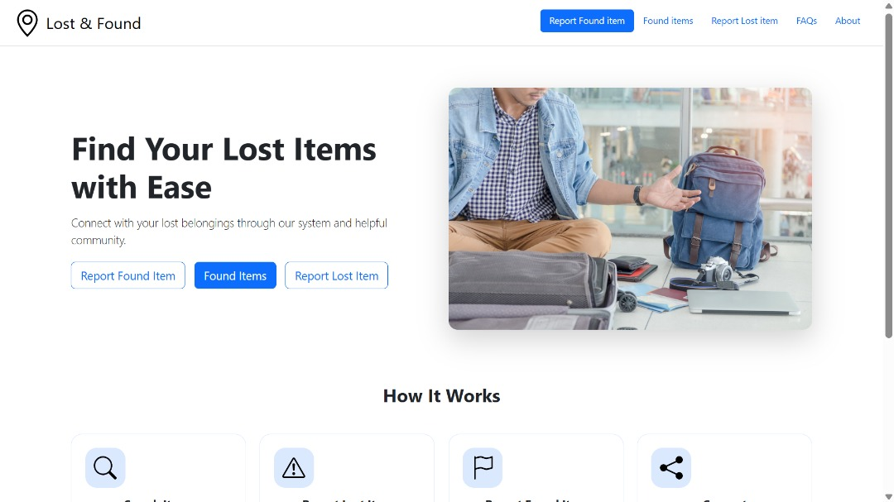

# Lost and Found site
---
A full-stack Lost & Found web application built with Node.js, Express, EJS, and Bootstrap.
Users can report lost items, submit found items with photos, browse all items, and contact the finder/owner.
Includes responsive UI, image uploads, clean form design, and community-driven item recovery.

Site live at https://lost-and-found-j9if.onrender.com

## 🖥️ Tech Stack

| Layer | Technology |
|-------|------------|
| Frontend | HTML, CSS, Bootstrap, EJS |
| Backend | Node.js, Express |
| Template Engine | EJS |
| Styling | Custom CSS + Bootstrap 5 |
| Hosting (Current) | Render |
| Hosting (Future) | Vercel / AWS / Supabase / Firebase |

## 📸 Screenshots

| Home Page |
|-----------|
|  |
